# ARCHITECTURE.md — `pac-pilot`

Thirteen diagrams, each a different lens. Read top-to-bottom to assimilate the whole system:
business context → users → product lifecycle → service decomposition → technical core → data & trust → deployment.

| # | Diagram | Lens |
|---|---|---|
| 1 | System context | Who talks to what |
| 2 | Runtime topology | Where code runs |
| 3 | Portable core (two targets) | The keystone decision |
| 4 | Bounded contexts | Service decomposition |
| 5 | Hexagonal core | Ports & adapters |
| 6 | Domain model | Data shape |
| 7 | Quote lifecycle | Product states |
| 8 | Installer journey | User perspective |
| 9 | Local-first sync | Offline → reconnect |
| 10 | Rule-pack lifecycle | Decentralized data + reproducibility |
| 11 | Ecosystem map | Users, partners, competitors |
| 12 | Deployment | FR / RGPD infra |
| 13 | Intervention lifecycle | The operational timeline (V1) + booking path (V1.5) |

> **One client only.** The delivery form is a single React PWA. "Two targets" throughout this document means
> the calculation core compiled to **JVM + JS** — not a cross-platform mobile app. There is no native build.

---

## 1. System context — who talks to what

The platform sits between the installer (who does all the work, on-site, mostly offline) and the homeowner (who only reads the devis). Everything else is data feeds and, strategically, partner surfaces that embed the engine.

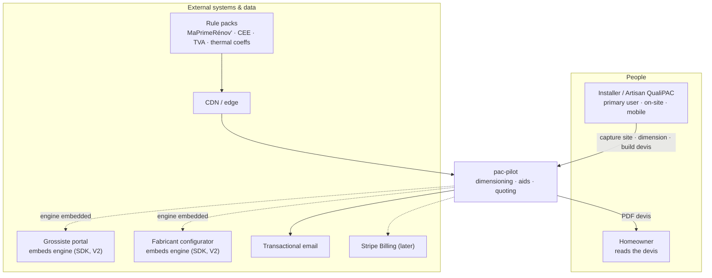

---

## 2. Runtime topology — where code runs

Sophistication at the edge, boredom in the cloud. The engines run **on the device** (offline UX) and **on the server** (verifier). The server is stateless and thin; Postgres is the only stateful piece.

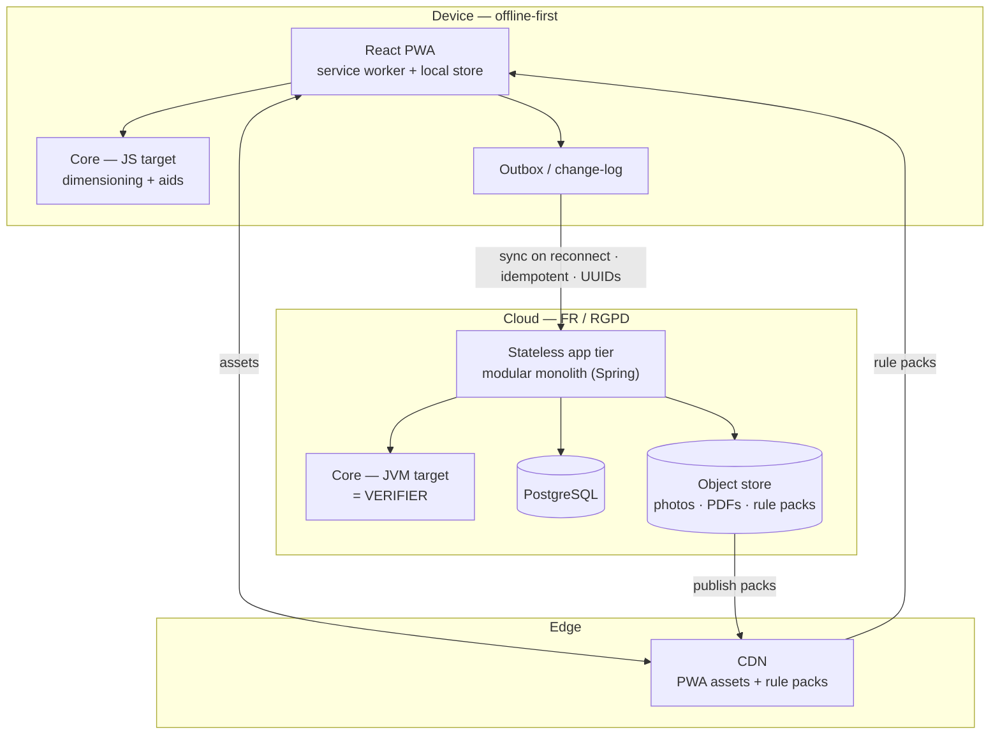

---

## 3. Portable core — one source, two targets

The single most important decision. The engines are written **once** in Kotlin Multiplatform and compiled to JVM (server) and JS (client). Client and server can never disagree on a formula. A shared suite of **golden vectors** (immutable input→output fixtures) is the correctness contract binding both targets forever.

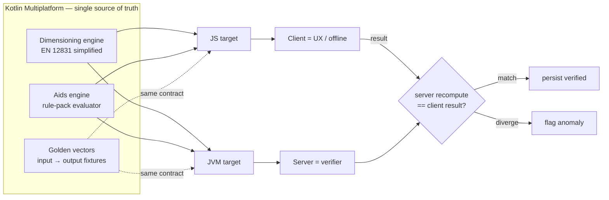

---

## 4. Bounded contexts — modular monolith

One deployable, hard internal walls. Any context can later be extracted into a service (e.g. a calculation API for a partner) without a rewrite. Highlighted contexts (Dimensioning, Aids) are the IP; the rest are plumbing.

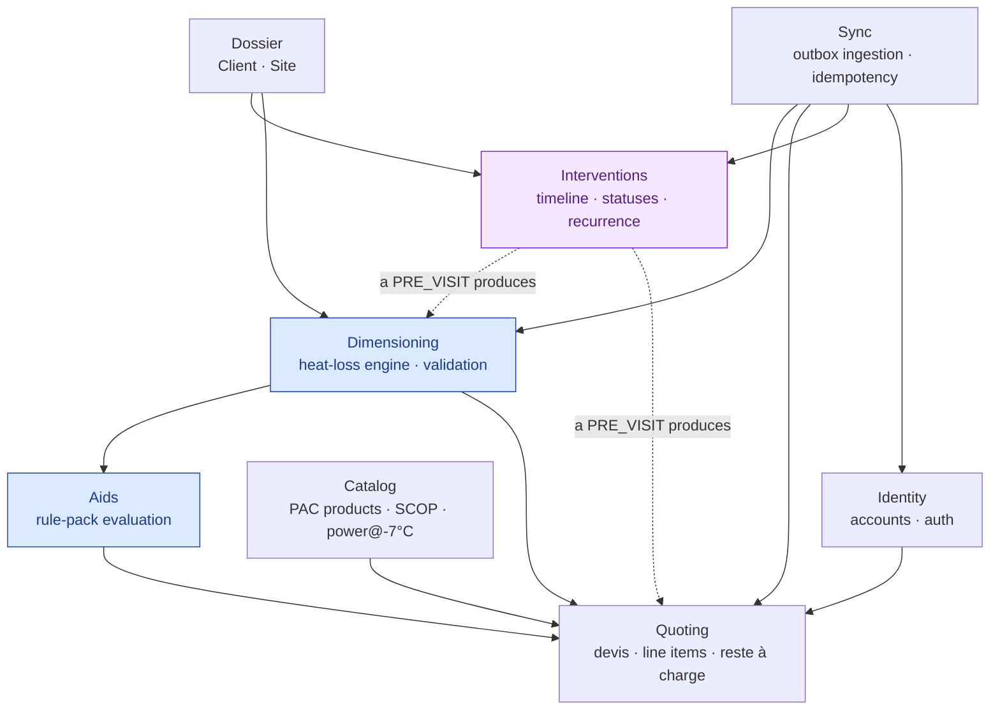

`Interventions` (purple) is the V1 addition: the artisan's operational timeline and the app's home screen.
It **consumes** Dossier and **references** the artifacts a visit produces — it owns no calculation. Note the
dependency direction: Dimensioning and Quoting know nothing about Interventions, so the context could be
removed or extracted without touching the IP.

---

## 5. Hexagonal core — ports & adapters

The domain (model + both engines) is pure Kotlin with zero framework imports. Everything else — REST, the embeddable SDK, persistence, PDF, storage, rule-pack loading — is an adapter behind a port. This is what makes the core portable *and* embeddable.

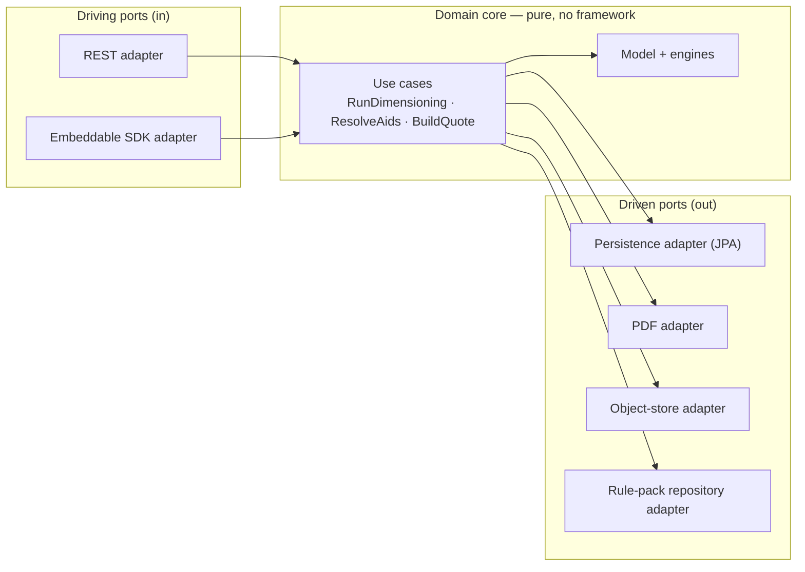

---

## 6. Domain model — data shape

Note what carries legal weight: `DIMENSIONING.validated_by/at` (the liability shield) and `QUOTE.rulepack_version` (reproducibility). Nothing stores only a final number; it stores the inputs + the rule version used.

`INTERVENTION` carries the operational layer. Its links to `DIMENSIONING` and `QUOTE` are optional in both
directions — a visit may produce nothing, and a dimensioning may exist without a scheduled visit. `address_snapshot`
is denormalized deliberately: it must survive later edits to the `Site`.

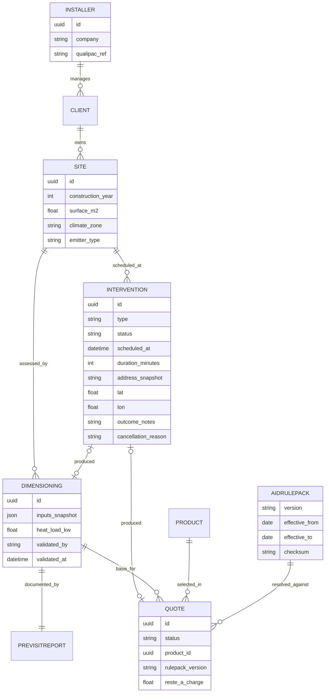

---

## 7. Quote lifecycle — product states

The two annotated states are the ones that matter legally and operationally: dimensioning happens offline; validation is an explicit human act that gets persisted.

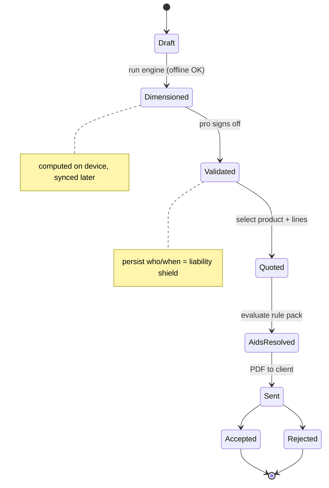

---

## 8. Installer journey — user perspective

Scores = how smooth the step feels. The high-value moment is on-site, offline, when the installer shows the homeowner the reste-à-charge live. Sync/verify happen quietly afterward.

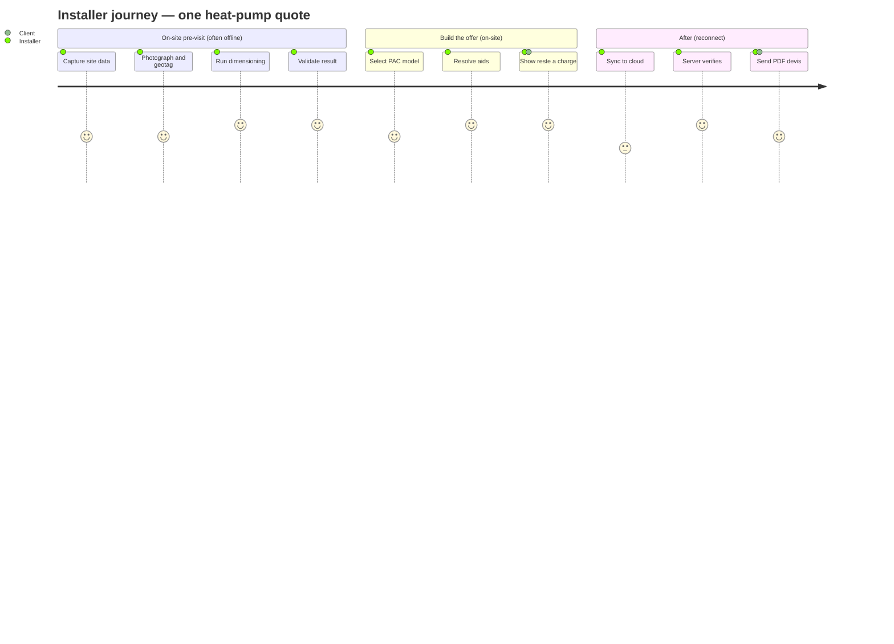

---

## 9. Local-first sync — offline to reconnect

The only genuinely distributed problem in the system, and a solved one: client UUIDs + outbox + idempotent ingestion + server recompute. Single-owner aggregates mean last-write-wins is enough — no CRDTs, no consensus.

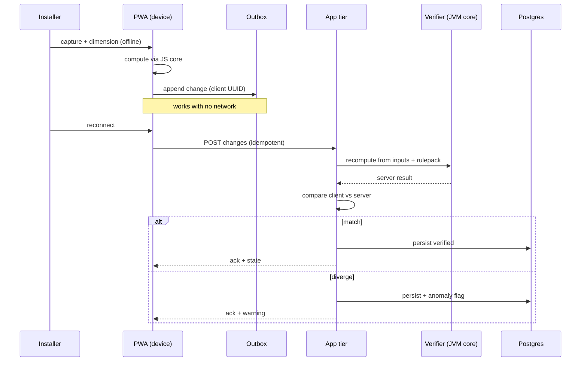

---

## 10. Rule-pack lifecycle — decentralized data + reproducibility

Barèmes are not queried live; each version is an immutable, checksummed artifact pushed to the CDN and cached on-device. A devis references its pack version, so any past devis reproduces exactly against the pack it was built with. Updating a barème = publishing a new pack — never mutating an old one, never a redeploy.

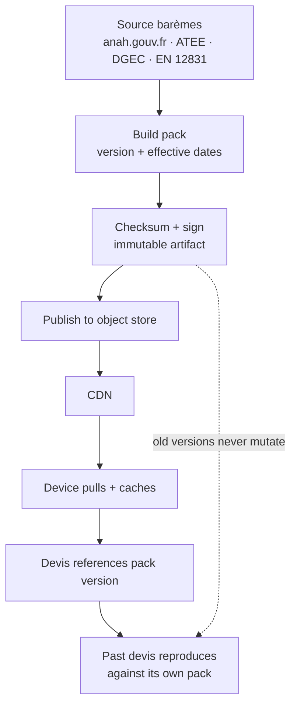

---

## 11. Ecosystem map — users, partners, competitors

Position at a glance: buyers are also users (short sale), partners solve distribution and trust, competitors are boxed by a specific counter-angle each.

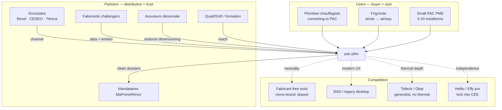

---

## 12. Deployment — FR / RGPD infra

Stateless app instances behind a load balancer, managed Postgres with PITR, S3-compatible object store, CDN in front. All in-region. Footprint stays at the ~€50–150/mo level; scale-out is adding replicas, not re-architecting.

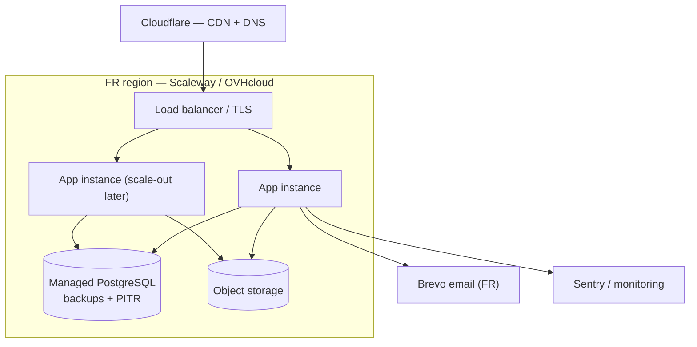

---

## 13. Intervention lifecycle — the operational timeline

The artisan's own visits, attached to a `Site`. **Not a general agenda**: it holds only what the app owns, so it
cannot go stale. Solid states are V1; the dashed `REQUESTED → CONFIRMED` path is the V1.5 booking link, modelled
now as an *entry path in front of* `PLANNED` so it is an addition rather than a migration.

The two rules that make the timeline trustworthy: **nothing is ever auto-confirmed** (the artisan explicitly
accepts every request), and **every cancellation captures a reason**. The recurrence edge is the retention
mechanism — a completed install schedules its own maintenance.

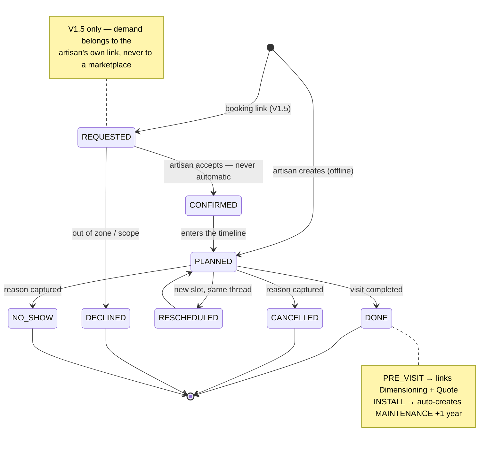

### Types and what each one triggers

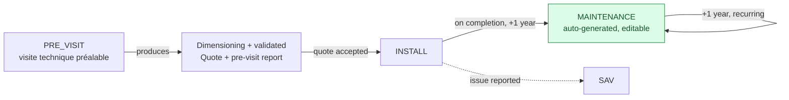

The green node is where retention comes from: an artisan whose whole maintenance schedule lives in the app does
not churn, and the recurrence surfaces revenue he is currently leaving on the table.

### Where it runs

Entirely local-first — no new infrastructure. Creation, edition, completion and all filters (date, type, status,
client, commune) are IndexedDB queries on the device; changes flow through the same outbox and idempotent
ingestion as every other aggregate (#9). Geocoding via `adresse.data.gouv.fr` (BAN — free, FR-hosted, no key) is
**opportunistic**: it runs when there is network and never blocks creating or completing an intervention.

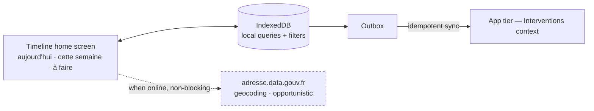

**Explicitly out of this context:** route/tournée optimization, drive-time calculation, availability publishing,
homeowner-facing discovery, reminders/SMS, and payment of any kind. Route preparation is post-V1; marketplace and
escrow are rejected outright (`CLAUDE.md` §3).
