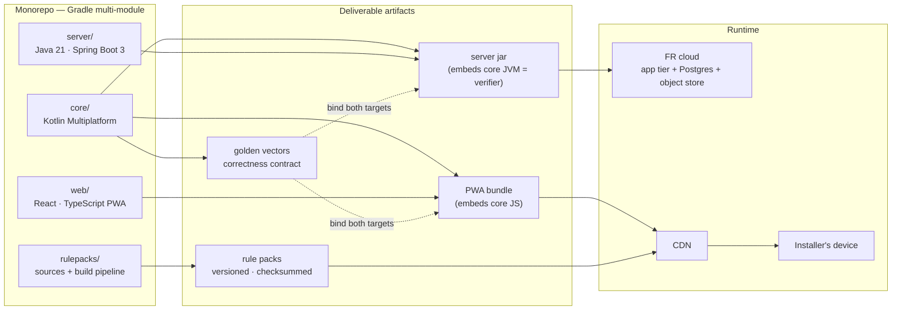
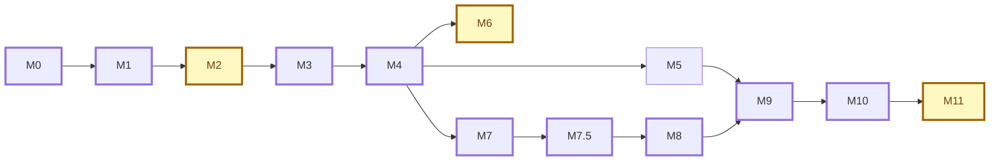

# DELIVERY-PLAN.md — `pac-pilot`

Solution decomposition, repository structure, entity ownership, and the chronological milestone
plan from zero to V1 delivery. Derives from `CLAUDE.md` §11 (build order) and `ARCHITECTURE.md`
#4 (bounded contexts). Where this file refines those documents, the refinement is flagged.

---

## 1. Solution decomposition — from source to running system

Three source modules produce four deliverable artifacts. The KMP core is the single source of
truth compiled into two of them; rule packs are data artifacts with their own release cycle,
independent of code deploys.



---

## 2. Repository structure

```
pac-pilot/
├── settings.gradle.kts
├── build.gradle.kts                  # convention plugins, version catalog
├── gradle/libs.versions.toml
│
├── core/                             # ── Kotlin Multiplatform: the IP ──
│   ├── build.gradle.kts              # targets: jvm(), js(IR)
│   └── src/
│       ├── commonMain/kotlin/fr/pacpilot/core/
│       │   ├── shared/               # value objects: PowerKw, TemperatureC, Percentage,
│       │   │                         #   MoneyEur, SurfaceM2, ClimateZone, EffectiveDate
│       │   ├── dimensioning/
│       │   │   ├── model/            # Dimensioning, InputsSnapshot, HeatLoadResult,
│       │   │   │                     #   AssumptionsLog, ValidationAct
│       │   │   ├── engine/           # DimensioningEngine + injectable FormulaSet
│       │   │   │                     #   (every coefficient SOURCE_TBD until validated)
│       │   │   └── port/             # RunDimensioning (in), FormulaSetProvider (out)
│       │   ├── aids/
│       │   │   ├── model/            # AidRulePack, ResolvedAids, ResteACharge
│       │   │   ├── engine/           # AidsEngine: pack evaluation at devis date
│       │   │   └── port/             # ResolveAids (in), RulePackRepository (out)
│       │   └── quoting/
│       │       ├── model/            # Quote, LineItem, QuoteStatus
│       │       └── port/             # BuildQuote (in)
│       ├── commonTest/
│       │   ├── kotlin/               # engine unit tests + the golden-vector harness (pure
│       │   │                         #   Kotlin, no framework — the cross-target contract)
│       │   └── vectors/              # *.vectors data files, embedded into commonTest by the
│       │                             #   generateGoldenVectors task; append-only (ADR-0009)
│       ├── jvmTest/                  # ArchUnit core-purity rules — ArchUnit reads bytecode,
│       │                             #   so they live here and cover commonMain via the JVM target
│       └── jsMain/                   # thin: @JsExport façade for the PWA
│                                     #   (no jvmMain: nothing JVM-specific is needed today)
│
├── server/                           # ── Java 21 modular monolith, one context = one package ──
│   ├── build.gradle.kts              # depends on core (JVM target); verifyNoKotlinInServer
│   │                                 #   fails the build on any .kt here (ADR-0010)
│   └── src/
│       ├── main/java/fr/pacpilot/server/
│       │   ├── identity/             # Installer account, auth (built in M10, not before)
│       │   ├── dossier/              # Client + Site records        [refines ARCH #4]
│       │   ├── interventions/        # timeline aggregate, statuses, recurrence rule
│       │   │                         #   (M7.5 — no calculation, consumes dossier)
│       │   ├── catalog/              # Product reference data + seed pipeline
│       │   ├── dimensioning/         # verifier wiring, validation act persistence
│       │   ├── aids/                 # pack resolution, pack storage adapter
│       │   ├── quoting/              # devis assembly, PDF port
│       │   ├── sync/                 # outbox ingestion, idempotency, verification,
│       │   │                         #   anomaly flags
│       │   └── platform/             # cross-context: config, security shell, web infra
│       │       └── (each context internally: domain/ · application/ ·
│       │            adapter/in/web/ · adapter/out/persistence|pdf|storage/)
│       ├── main/resources/db/migration/   # Flyway, forward-only; reference data seeded
│       │                                  #   via versioned migrations
│       └── test/java/               # context tests + the Java↔Kotlin interop test; ArchUnit
│                                     #   context-boundary and adapter-direction rules land at M4
│                                     #   (core purity lives in core/src/jvmTest)
│
├── web/                              # ── React + TS PWA, offline-first ──
│   ├── package.json
│   └── src/
│       ├── app/                      # shell, routing, service worker, install prompt
│       ├── core-bridge/              # typed wrapper around core JS target
│       ├── store/                    # IndexedDB wrapper, aggregate repositories
│       ├── outbox/                   # append-only change-log, client UUIDs
│       ├── sync/                     # reconnect protocol, verification results, anomalies
│       ├── rulepacks/                # pack pull, cache, checksum verification
│       └── features/
│           ├── interventions/        # timeline home screen, CRUD, filters, recurrence
│           ├── dossier/              # client + site capture
│           ├── previsit/             # survey flow, photos (geotag + timestamp)
│           ├── dimensioning/         # run + assumptions display + validation act
│           ├── selection/            # catalog filtering (power band, emitters, dB)
│           └── devis/                # lines, aids, reste-à-charge screen, PDF send
│
├── rulepacks/                        # ── data artifacts, own release cycle ──
│   ├── sources/                      # encoded barèmes: maprimerenov/ cee/ tva/ thermal/
│   ├── pipeline/                     # build → validate → checksum → sign → publish
│   └── published/                    # immutable, versioned outputs (mirror of object store)
│
├── docs/                             # ARCHITECTURE.md · PRODUCT-VIEWS.md · DELIVERY-PLAN.md
│   └── decisions/                    # ADRs (one per locked decision)
└── .github/workflows/                # ci.yml: build + test JVM & JS + ArchUnit + web
```

---

## 3. Entity ownership — every aggregate has one home

Refinement of `ARCHITECTURE.md` #4: a seventh context, **Dossier**, owns `Client` + `Site`
(they had no owning context; Quoting and Dimensioning both consume them, neither owns them).

| Aggregate | Owning context | Defined in | Persisted by | Legal weight |
|---|---|---|---|---|
| `Installer` | Identity | `server/identity` | JPA adapter | account of record |
| `Client` | Dossier | `server/dossier` | JPA adapter | RGPD: personal data |
| `Site` | Dossier | `server/dossier` | JPA adapter | — |
| `Intervention` | Interventions | `server/interventions` | JPA adapter | operational record; `address_snapshot` denormalized |
| `Dimensioning` | Dimensioning | `core/dimensioning/model` | JPA adapter (server) | **inputs snapshot + `validatedBy/At`** |
| `PreVisitReport` | Dimensioning | `server/dimensioning` | JPA + object store (photos) | evidential photos |
| `Product` | Catalog | `server/catalog` | JPA, seeded migrations | read-mostly reference |
| `Quote` (Devis) | Quoting | `core/quoting/model` | JPA adapter (server) | **resolved aids + pack version** |
| `AidRulePack` | Aids | `core/aids/model` | object store + CDN, immutable | **reproducibility anchor** |
| Outbox entry | Sync | `web/outbox` (client) · `server/sync` (ingest) | IndexedDB → Postgres | idempotency key |

Rules of thumb: computation models live in `core/commonMain` (both targets need them);
persistence-only aggregates live server-side; the PWA holds replicas, never authority.

`Intervention` is an **eighth context** and stays server-side + client-replica: it carries no calculation, so it
has no reason to live in the KMP core. It consumes Dossier and holds optional references to the `Dimensioning`
and `Quote` a visit produced — never the reverse, so the IP contexts stay unaware of it.

---

## 4. Milestones — chronological order, M0 → V1

One milestone = one epic = one epic branch, merged no-ff into `develop` when its definition of
done holds. Order follows `CLAUDE.md` §11; ⚑ marks a human gate that blocks the milestone from
closing. Sizes are rough relative effort (S ≈ days, M ≈ 1–2 weeks, L ≈ 2–4 weeks, solo cadence)
— estimates, not commitments.

| # | Epic | Content | Definition of done | Size |
|---|---|---|---|---|
| **M0** | Scaffold | Gradle KMP multi-module (`core` JVM+JS, `server`, `web`), CI building + testing both targets, ArchUnit purity rules, golden-vector harness skeleton, health endpoint, Postgres + Flyway via docker-compose | green CI on an empty-but-wired monorepo | S |
| **M1** | Domain model | `commonMain` pure Kotlin: value objects for units, all aggregates of §3 that belong in core, zero persistence | unit tests + ArchUnit prove purity | M |
| **M2** | Dimensioning engine ⚑ | engine behind port, **formula set injectable**, every coefficient `SOURCE_TBD`, golden vectors as structured placeholders | ⚑ **human validates the simplified EN 12831 method before any coefficient becomes authoritative** | L |
| **M3** | Aids engine | rule-pack evaluator in `commonMain`, sample pack, date-resolved versioning | reproducibility test: a past devis date resolves the old pack version | M |
| **M4** | Server backbone | JPA adapters + Flyway migrations for all aggregates, catalog seed pipeline, JVM core wired as **verifier**, minimal REST: create dossier → dimension → validate → quote → resolve aids | end-to-end API flow green in integration tests | L |
| **M5** | PDF adapter | deterministic devis PDF + pre-visit report template (photo slots stubbed until M9) | byte-identical output for identical input | M |
| **M6** | Rule-pack pipeline ⚑ | build → validate → checksum → sign → publish → CDN; server resolves by devis date | ⚑ **first real MaPrimeRénov'/CEE/TVA pack encoded and human-verified against official sources** | M |
| **M7** | PWA foundation | offline-first shell: service worker, IndexedDB store, core JS bridge, dossier + survey + dimensioning + validation + selection + devis screens, pack pull/cache/verify | full pre-visit flow completes in airplane mode | L |
| **M7.5** | Interventions | timeline aggregate + `server/interventions` context, offline CRUD, statuses (`PLANNED / DONE / CANCELLED / RESCHEDULED / NO_SHOW`, open enum for the V1.5 booking path), local filters (date · type · status · client · commune), timeline home screen, opportunistic BAN geocoding, **maintenance auto-recurrence on completed INSTALL** | full CRUD + filters work in airplane mode; completing an install creates next year's maintenance | M |
| **M8** | Sync & verification | outbox, client UUIDs, idempotent ingestion, server recompute vs client result, anomaly flags surfaced in UI | golden-vector divergence test: injected drift is flagged, never silently corrected | L |
| **M9** | Pre-visit media | photo capture (timestamp + geotag), object-storage adapter, pre-visit report PDF completed | report PDF renders synced photos; evidential metadata persisted | M |
| **M10** | Identity & auth | Spring Security, email/password + magic link, single-user accounts (`CLAUDE.md` defers auth "until asked" — planning it here is the ask; nothing depends on it earlier) | authenticated end-to-end flow; session lifecycle reviewed | M |
| **M11** | Hardening & go-live | FR deployment (Scaleway/OVH), CDN, monitoring/Sentry, backups + PITR, RGPD ops (DPAs, retention, income-data handling review), pilot beta with real installers ⚑ | ⚑ **pilot installers complete real pre-visits; go/no-go on their feedback** | L |

**V1 is delivered at M11 close.** Explicitly absent, per `CLAUDE.md` §3/§12: multi-seat, mandataire flow,
embeddable SDK, native mobile builds — all post-V1 (H2 in `PRODUCT-VIEWS.md` #12).

Decided and deliberately deferred (do not scaffold):

| Item | When | Why not now |
|---|---|---|
| Artisan-owned booking link (`REQUESTED → CONFIRMED`) | **V1.5**, straight after go-live | Cheap and differentiating, but not needed to prove the wedge. The status enum is left open at M7.5 so it is an addition, not a migration |
| Electronic signature of the devis | V2, priority | The real conversion moment; higher value and lighter regulation than money handling |
| "Prepare my day" (ordered stops, drive time, handoff to Waze/Maps) | post-V1 | 3–4 stops/day in a known region is not a routing problem. Reframed away from optimization |
| Payments of any kind — acompte links, escrow | **Rejected** | Regulated activity; wrong fit for a 60 %-subsidised five-figure job |
| Public marketplace / lead-gen | **Rejected for V1–V2** | Inverts the independence positioning that is the wedge; puts a solo founder against funded lead-gen incumbents. Revisit only with supply density (H3) |

### Dependency graph & critical path

M5, M6 and M7 all parallelize after M4; everything else is a chain. The critical path runs through
the PWA and sync — the offline core of the product bet.

**M7 was re-parented from M6 to M4 at M6-01** ([ADR-0019](decisions/0019-m7-no-longer-waits-for-m6.md)).
M7 builds the offline *mechanism*, which needs no real barème — and `NoPackPublished` is the current
production behaviour ([ADR-0017](decisions/0017-no-provisional-rule-pack-on-the-server.md)), not a
test condition, so the PWA has to handle it either way. **The pitch still waits for the M6 ⚑ gate:**
a synthetic reste-à-charge demonstrates the mechanism, not the offer, and must not be shown to an
artisan as if it were the offer.



### Working convention (mirrors the KATA convention)

- Branch per epic: `epic/M2-dimensioning-engine`; tickets as `M2-01`, `M2-02`, …
- Commits: `[M2][M2-01] <imperative summary>`; epic merged `--no-ff` into `develop`.
- Each ⚑ gate is a ticket of its own — it produces an ADR in `docs/decisions/` when it closes.
- Golden vectors are append-only from M2 onward: a vector, once published, never changes.
