# PRODUCT-VIEWS.md — `pac-pilot`

Twelve product-side diagrams complementing the twelve technical ones in `ARCHITECTURE.md`.
Where ARCHITECTURE answers *how the system works*, this file answers *why it exists, who it serves,
how it is used, what it changes, and what can kill it*.

| # | Diagram | Lens |
|---|---|---|
| 1 | Problem space today | The pain being replaced |
| 2 | Jobs-to-be-done → features | Why each V1 feature exists |
| 3 | Money & aids flow | Economic impact on the value chain |
| 4 | Use cases by actor | Who does what with the product |
| 5 | The 15-minute pre-visit | The core usage moment, tap by tap |
| 6 | Before / after | Time-to-devis compression |
| 7 | Adoption funnel & habit loop | How an artisan becomes a paying user |
| 8 | Trust & audit chain | Why the output is defensible |
| 9 | Degraded-mode UX | What the user sees when things go wrong |
| 10 | KPI tree | What we measure, rooted in one north star |
| 11 | Risk map | What can kill the product |
| 12 | Horizons V1 → V2+ | Where this goes |

---

## 1. Problem space today — the pain being replaced

The tool exists because one quote today spans several days, three disconnected tools, and an
uncomfortable liability gap. Every red node is a pain the V1 wedge removes.

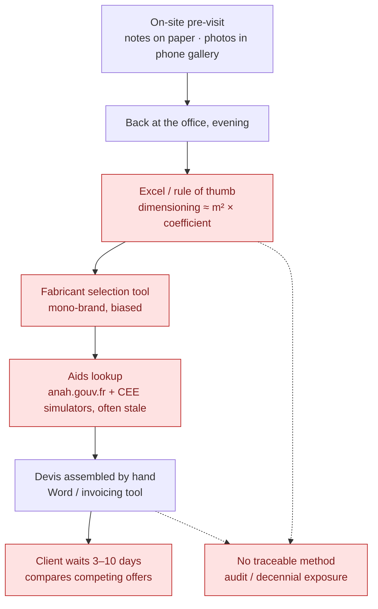

---

## 2. Jobs-to-be-done → features — why each V1 feature exists

Every V1 feature traces to a job the installer already has. If a proposed feature has no arrow
from a job, it does not belong in V1.

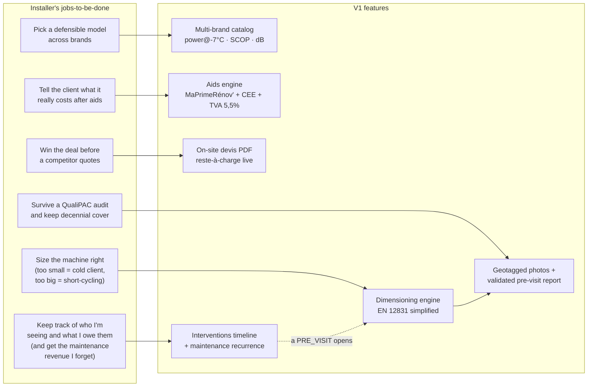

**Validate J6 before building F6.** The job is asserted, not confirmed. Interview question: *"Vos clients,
comment ils prennent rendez-vous avec vous aujourd'hui? Et ça vous pose problème?"* — followed by *"Comment vous
gérez votre planning? Montrez-moi."* Watch for the trap answer: many artisans **like** the phone call, because
it is how they qualify a job and decline politely. If most already run a synced Google Calendar and are happy,
F6 shrinks to the dossier timeline only and the booking link (H1.5) is a nice-to-have, not a priority.

---

## 3. Money & aids flow — economic impact on the value chain

The product touches none of the money. It computes, itemizes, and versions the aid amounts so the
reste-à-charge shown on-site matches what the flows below eventually produce. That neutrality is
deliberate: handling funds would mean mandataire accreditation and liability (V2, via partner).

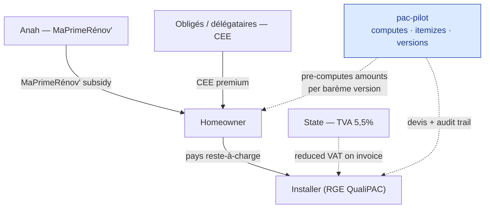

> Exact payment routing (avance, mandataire, délégataire) varies by dossier — the engine computes
> amounts and eligibility, never the disbursement path. Flows above are the canonical direct case.

---

## 4. Use cases by actor — who does what

Three actors only. The homeowner never logs in — they are shown a screen and receive a PDF.
The system itself is an actor (verification, pack refresh) because those acts carry product meaning.

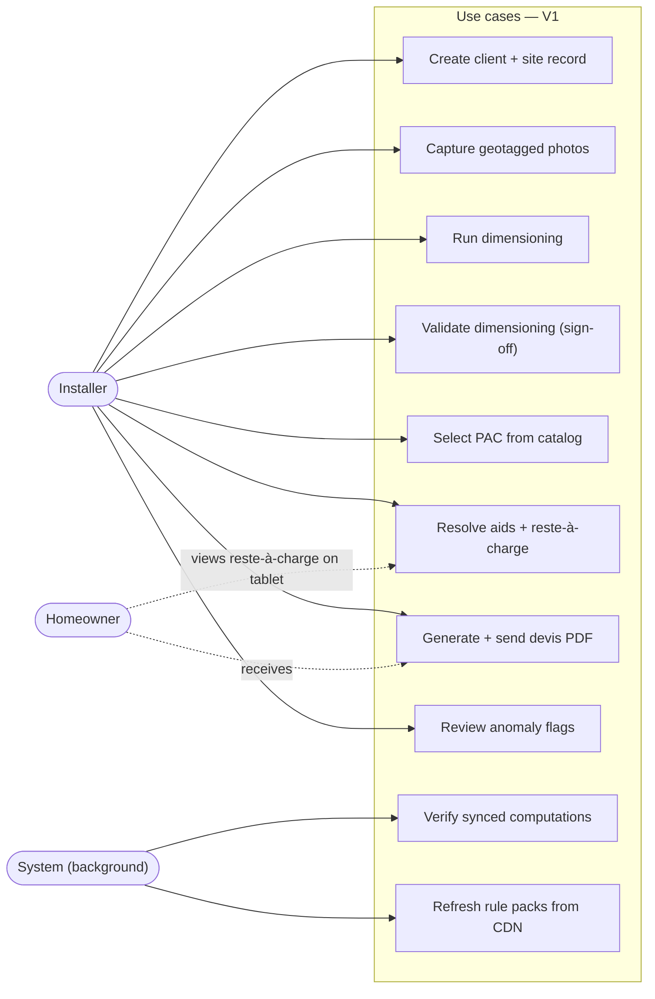

---

## 5. The 15-minute pre-visit — the core usage moment

The entire product bet compressed into one screen flow. Budget per step is a design constraint:
if a step exceeds its budget, the UX has failed regardless of engine quality. Every step works offline.

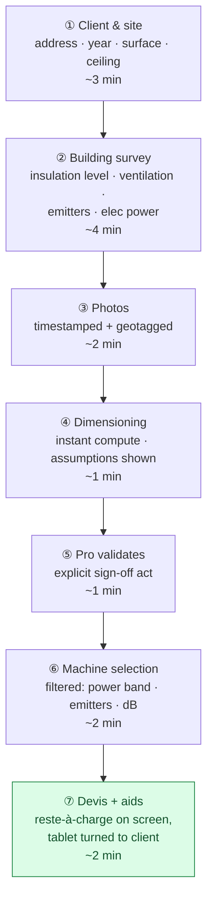

---

## 6. Before / after — time-to-devis compression

The measurable promise: the same deliverable in one visit instead of a multi-day round-trip.
The strategic effect is at the end — the client commits before competitors have even quoted.

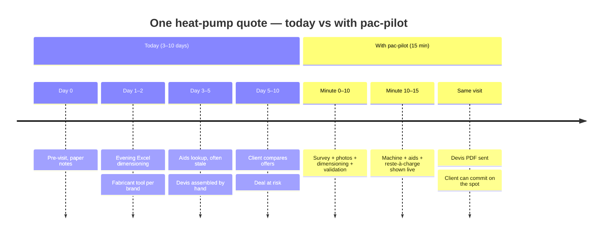

---

## 7. Adoption funnel & habit loop — how an artisan becomes a paying user

The buyer is the user, so the funnel is short — but the audience is non-digital-native, so the
first-value moment must arrive inside the first real pre-visit. Retention is a loop, not a stage:
every completed devis reinforces the habit and feeds referral in a word-of-mouth trade.

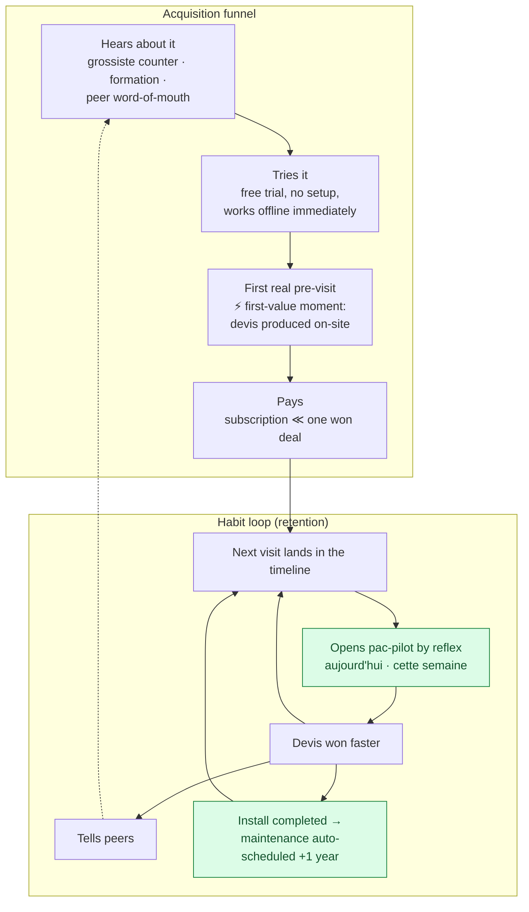

Two green nodes carry retention. **H2** is what the Interventions timeline buys: before it, the app was only
opened while standing in a cellar; now it is the home screen for the working week. **H5** is the stronger of the
two — an artisan whose entire maintenance schedule lives here does not churn, and the recurrence hands him a
recurring-revenue stream he is currently leaving on the table.

---

## 8. Trust & audit chain — why the output is defensible

The product's deepest moat is not the calculation — it is that every number can be replayed and
attributed years later. This chain is what a QualiPAC auditor or decennial insurer walks backwards.

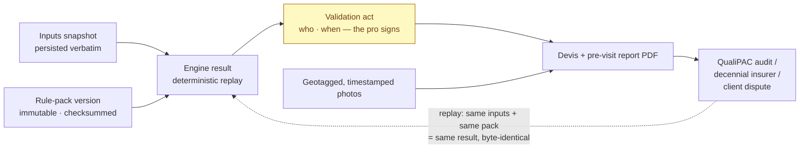

---

## 9. Degraded-mode UX — what the user sees when things go wrong

Offline is the happy path, so "degraded" means something else here. Three honesty rules: never block
the visit, never silently guess, never hide a divergence. Each degraded state has an explicit banner.

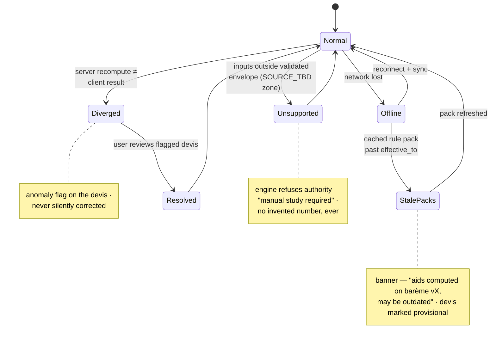

---

## 10. KPI tree — what we measure

One north star, decomposed into three drivers. Anything not feeding this tree is vanity.
The counter-metrics guard the two ways the north star could be gamed: rushed junk devis and
silent computational drift.

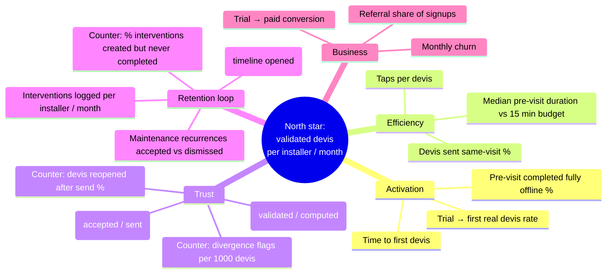

---

## 11. Risk map — what can kill the product

Positioned by likelihood and severity. The top-right quadrant holds the two existential risks —
both are domain risks, not technical ones, which is why the build order gates on human validation
of the simplified method before any coefficient becomes authoritative.

Two risks added with the Interventions scope. **Agenda competition:** a calendar that holds only *some* of his
appointments is worse than none — distrust in the timeline bleeds into the rest of the app. Mitigation is
framing, not features: it is *"mes visites"*, never *"mon agenda"*, and it only ever contains what the app owns.
**iOS PWA:** install lives in the Share menu, background sync is unreliable, and iOS can evict stored data after
weeks of disuse — which matters for a user who may go a week between pre-visits. Mitigations: prompt sync on
open, warn on unsynced data, request persistent storage. Test on a real iPhone early, and ask iPhone-vs-Android
in the field interviews — if the base is mostly Android, this risk largely evaporates.

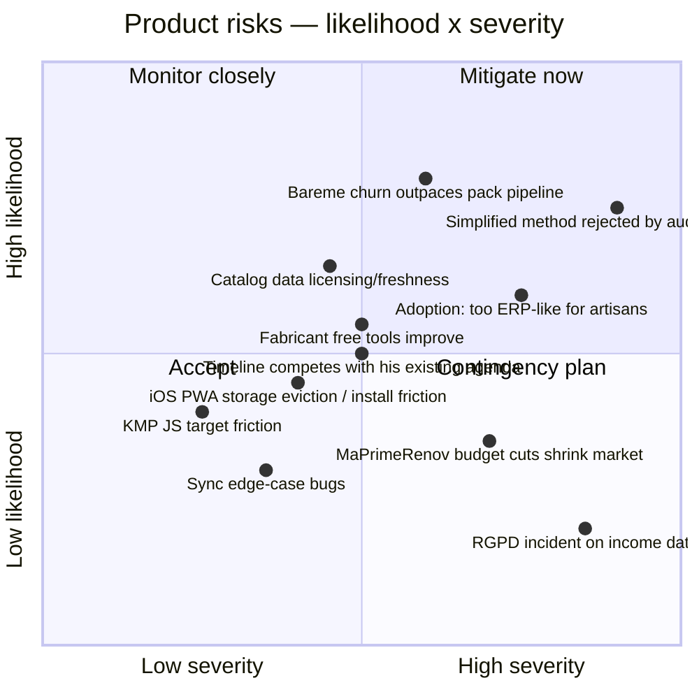

---

## 12. Horizons V1 → V2+ — where this goes

The wedge earns the right to expand. Each horizon reuses the same core engines — that is why they
stay pure and behind ports. Nothing in H2/H3 is built, scaffolded, or modeled in V1.

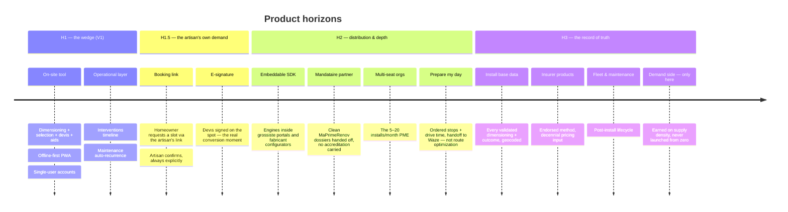

**On the marketplace question.** Homeowner-side discovery is rejected for V1 and V2, not merely postponed. It
inverts the independence positioning that is the entire wedge against the CEE délégataires (#11), and it would
put a self-funded solo founder against funded lead-gen incumbents on their strongest ground. The defensible
version arrives only at H3: with ~1,000 instrumented artisans and geocoded coverage, demand-side becomes the
monetization of an asset no lead-gen player has — qualified, verified supply. Earned, not launched.

Payments are rejected outright at every horizon in this plan: holding funds on behalf of an artisan is a
regulated activity, and it sits badly on a five-figure job that is ~60 % publicly subsidised.
